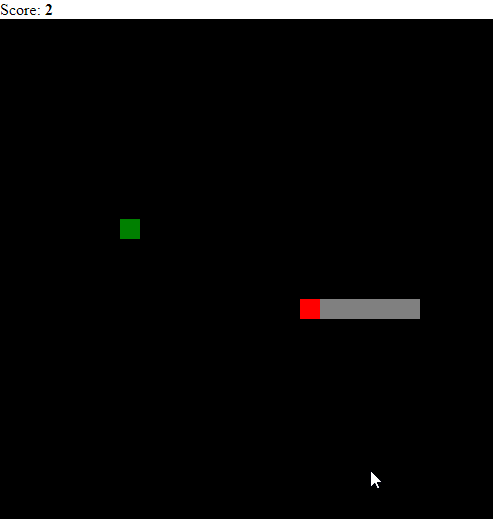

# simple-snake

Snake game in less than 160 lines of javascript code.

This game is for educational purposes. Snake is modeled as linked-list of segments where each segment store x and y coordinates. Head segment stores direction too.

For move the snake, tail is erased, head is moved towards snake direction and new segment is rendered in gap between head and rest of snake's body. Then tail becomes the previous segment.

## Running simple-snake

- Open snake.html in any web browser with HTML5  support.

- Or via Nodejs, run:

`npm install`

and then

`npm start`

Last command will launch gulp and it will execute browser-sync opening a web browser and loading snake.html.
